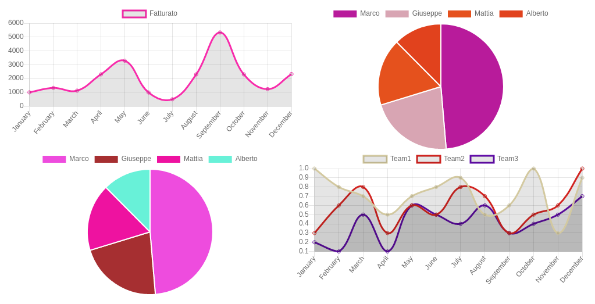

# Esercitazione con Chart.js

### Istruzioni

1. Eseguire su un server
2. Nello Step 3 inserire una delle seguenti query-string per vedere diversi risultati:
```
?level=guest
?level=employee
?level=clevel
```

